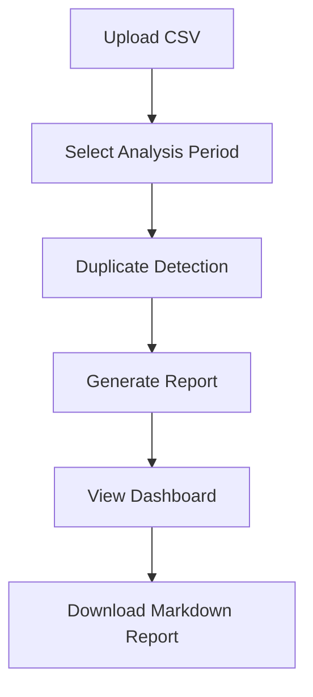

# Trading Journal Analytics Tool

A comprehensive Python-based analytics tool for options and futures traders. Analyze, visualize, and reflect on your trading journal data with advanced metrics, LLM-powered insights, and professional reports.

---
## Features
- TastyTrade CSV upload and parsing
- Duplicate detection and review
- Strategy detection (single leg, vertical, straddle/strangle, complex)
- Trade linking and position lifecycle tracking
- Performance analytics (win/loss, PnL, time-weighted/risk-adjusted returns)
- Advanced analytics (trend/outlier/risk analysis)
- LLM integration for insights and reflection questions
- Static chart generation (matplotlib/seaborn)
- Markdown report generation with embedded charts
- Streamlit web interface for interactive analysis
- Downloadable monthly reports

---
## Environment & Deployment Instructions

### Python Version
- **Python 3.9+ is required** (recommended for M1 Mac compatibility)
- For M1 Mac: Use [pyenv](https://github.com/pyenv/pyenv) or Homebrew to install Python 3.9+ if needed

### Virtual Environment (Recommended)
```bash
python3 -m venv .venv
source .venv/bin/activate
```

### Install Dependencies
```bash
pip install -r requirements.txt
```

### Environment Variables
- Copy `.env.example` to `.env` and set your OpenAI API key and other settings as needed

### Running the App
- Use the provided startup script:
```bash
chmod +x run.sh
./run.sh
```
- Or run manually:
```bash
streamlit run src/app/streamlit_app.py
```

---
## API Documentation (Key Components)

### `src/app/main_controller.py`
**MainController**: Orchestrates the full workflow (CSV → analysis → report)
- `process_csv(file)`: Loads and validates CSV file
- `analyze_trades()`: Runs trade parsing, linking, analytics
- `generate_llm_insights()`: Runs LLM analysis
- `generate_charts()`: Generates charts
- `assemble_report()`: Assembles markdown report
- `export_report()`: Saves and provides download link

**Example:**
```python
from src.app.main_controller import MainController
controller = MainController()
controller.process_csv('my_trades.csv')
controller.analyze_trades()
controller.generate_llm_insights()
controller.generate_charts()
controller.assemble_report()
link = controller.export_report()
```

### `src/processors/csv_processor.py`
**CSVProcessor**: Loads and validates TastyTrade CSVs, converts rows to Trade objects
- `load_csv()`: Loads CSV and checks required columns
- `validate()`: Checks for required columns
- `to_trades()`: Converts DataFrame rows to Trade objects, skips malformed rows

**Example:**
```python
from src.processors.csv_processor import CSVProcessor
processor = CSVProcessor('my_trades.csv')
df = processor.load_csv()
trades = processor.to_trades()
```

### `src/processors/duplicate_detector.py`
**DuplicateDetector**: Detects duplicate Order # entries
- `find_duplicates()`: Returns DataFrame of duplicate rows
- `duplicate_summary()`: Returns summary statistics
- `structured_results()`: Returns summary and duplicate records for UI

**Example:**
```python
from src.processors.duplicate_detector import DuplicateDetector
detector = DuplicateDetector(df)
results = detector.structured_results()
print(results['summary'])
```

### `src/parsers/description_parser.py`: Parses trade descriptions
- `parse_description(description)`: Parses a single trade description into a Trade object
- `parse_all_descriptions(df)`: Applies `parse_description` to all rows in a DataFrame

### `src/analyzers/strategy_detector.py`: Detects option strategies
- `detect_strategy(trade)`: Determines the strategy type (e.g., call, put, straddle, strangle)
- `is_straddle(trade)`: Checks if a trade is a straddle
- `is_strangle(trade)`: Checks if a trade is a strangle

### `src/analyzers/trade_linker.py`: Links trades into positions
- `link_trades(trades)`: Groups trades into positions based on Order # and Side
- `get_position_summary(position)`: Summarizes a position's performance

### `src/analytics/metrics_calculator.py`: Calculates performance metrics
- `calculate_win_rate(trades)`: Calculates win rate
- `calculate_average_pnl(trades)`: Calculates average PnL
- `calculate_time_weighted_return(trades)`: Calculates time-weighted return
- `calculate_risk_adjusted_return(trades)`: Calculates risk-adjusted return

### `src/analytics/advanced_analyzer.py`: Advanced analytics (trends, outliers)
- `analyze_trends(trades)`: Identifies trends in PnL and volume
- `identify_outliers(trades)`: Detects unusual PnL or volume patterns
- `analyze_risk(trades)`: Evaluates risk metrics (e.g., max drawdown)

### `src/llm/openai_client.py`: OpenAI API integration
- `get_llm_insights(prompt)`: Sends a prompt to the LLM and returns the response
- `generate_reflection_questions(trades)`: Generates reflection questions based on trade data

### `src/insights/insight_generator.py`: Generates insights
- `generate_insights(trades)`: Combines LLM insights with trade data for a comprehensive report

### `src/visualizations/chart_generator.py`: Generates charts
- `generate_performance_chart(trades)`: Creates a line chart of PnL over time
- `generate_strategy_distribution_chart(trades)`: Creates a bar chart of strategy distribution
- `generate_risk_metrics_chart(trades)`: Creates a line chart of risk metrics

### `src/reports/markdown_generator.py`: Markdown report generation
- `generate_markdown_report(data)`: Generates a markdown report from a dictionary of data
- `embed_charts(markdown_text, charts)`: Embeds generated charts into the markdown

### `src/reports/report_assembler.py`: Assembles full reports
- `assemble_full_report(data)`: Combines all report components (summary, charts, insights)

### `src/reports/export_handler.py`: Handles report export/download
- `save_report(report_text, filename)`: Saves the generated report to a file
- `provide_download_link(filename)`: Provides a download link for the saved report

### Configuration Options
| Option             | Source         | Description                                 |
|--------------------|---------------|---------------------------------------------|
| OPENAI_API_KEY     | .env/config.py | OpenAI/LLM API key                          |
| OPENAI_API_BASE    | .env/config.py | LLM API endpoint (for LM Studio, etc.)      |
| OPENAI_MODEL       | .env/config.py | LLM model name (e.g., gpt-3.5-turbo)        |
| LOG_LEVEL          | .env/config.py | Logging level (INFO, DEBUG, etc.)           |

---
## Streamlit User Guide

### Step-by-Step Workflow
1. **Upload CSV:** Use the upload section to select your TastyTrade file.
2. **Select Analysis Period:** Choose the date range for analysis.
3. **Duplicate Detection:** Review and confirm detected duplicates.
4. **Generate Report:** Click to process data and generate a markdown report.
5. **Dashboard:** View performance metrics, charts, LLM insights, and download link.
6. **Download:** Click the download link to save your report.
7. **Error Handling:** Errors and progress are displayed in the UI.

### Sample Workflow


---
## Sample Data & Example Workflow

### Sample CSV (tests/sample_valid_trades.csv)
```
Symbol,Price,Time,Order #,Description,Expiry,Strike,OptionType,Side,Quantity
AAPL,2.5,2024-07-01 09:30,123,Buy call,2024-07-19,150.0,Call,BTO,1
MSFT,1.8,2024-07-01 10:00,456,Buy put,2024-07-19,300.0,Put,BTO,2
```

### Example Workflow
1. **Start the app:**
   ```bash
   ./run.sh
   # or
   streamlit run src/app/streamlit_app.py
   ```
2. **Upload the sample CSV:**
   - Use the file uploader in the web UI to select `tests/sample_valid_trades.csv`.
3. **Select analysis period:**
   - Choose the date range (auto-filled from the CSV if available).
4. **Review duplicate detection:**
   - The UI will show if any duplicate Order # entries are found.
5. **Generate the report:**
   - Click the "Generate Report" button.
6. **View dashboard:**
   - See performance metrics, charts, LLM insights, and action items.
7. **Download the report:**
   - Click the download link to save the markdown report for journaling or review.

This workflow can be repeated with your own TastyTrade CSV exports for full analytics and reporting.

---
## Usage

### Streamlit Web App
- Upload your TastyTrade CSV
- Select analysis period
- Review duplicate detection results
- Generate and download monthly reports

### Command-Line (for testing)
Run tests:
```bash
pytest tests/
```

---
## Testing
- **Unit and integration tests:**
  ```bash
  pytest tests/
  ```
- **Streamlit UI tests:**
  - UI tests verify rendering up to the file upload point.
  - **Limitation:** File upload simulation is not supported by Streamlit's AppTest as of July 2024. Full end-to-end UI tests are not possible; see test docs for details.
- **Backend workflow tests:**
  - Use `MainController` tests for upload-to-report integration.
- **HTTP Request Tests:**
  - Tests for HTTP requests use `requests-mock` for simulating API responses
  - See `docs/http_testing_guide.md` for detailed testing patterns
  - Examples in `tests/test_broker_api_client.py` and `tests/test_llm_analysis_service.py`
  - Includes comprehensive testing for timeouts, connection errors, HTTP errors, and invalid responses
  - ✅ **COMPLETE**: HTTP testing framework fully implemented and tested

---
## Troubleshooting
- **File upload not working in tests:** This is a known limitation of Streamlit's testing API. Test backend logic separately.
- **OpenAI API errors:** Ensure your API key is set in `.env` and you have internet access.
- **M1 Mac issues:** All dependencies are compatible; use `pip` with a Python 3.9+ environment.
- **Other issues:** Check logs and error messages in the UI or console.

---
## Deployment
- **Local:**
  - Run `./run.sh` or `streamlit run src/app/streamlit_app.py`
  - All dependencies in `requirements.txt`
- **M1 Mac:**
  - Use a Python 3.9+ environment (e.g., via `pyenv`)
  - Install dependencies as above
- **Startup script:**
    ```bash
    #!/bin/bash
    export $(cat .env | xargs)
    streamlit run src/app/streamlit_app.py
    ```

---
## Maintenance & Version Control
- Use `git` for version control
- Tests and CI recommended for updates
- Backup `.env` and reports as needed
- For future enhancements, see `Todo.md` and `Specification.md`

---
## Acknowledgements
- Built with Streamlit, pandas, matplotlib, seaborn, OpenAI, and Jinja2
- See `Specification.md` for full technical details
